# dcipher-insight-professional-plugin

Claude plugin packaging Dcipher Analytics' Insight Booster MCP connector as a set of
business-intelligence skills. The connector supplies the tools; these skills supply the
analyst judgement about which tools to chain, with what defaults, and what to do with the
results.

**Status: early draft.** The skills are written against the connector's tool schemas but
have not yet been evaluated against real prompts, so treat the tool chains and defaults as
proposals rather than documentation. See [`CONTRIBUTING.md`](CONTRIBUTING.md) for the
authoring workflow and [`docs/eval-prompts.md`](docs/eval-prompts.md) for the test set.

## Design

Skills are named after **the recurring deliverable a BI subrole owns**, not after the
subrole and not after the underlying workbench. A user arrives with a task ("what has
Siemens been up to"), not an identity and not a visualisation preference, so descriptions
key on the observable task. The role positioning lives in the SKILL.md body, where it
shapes the output voice without hurting trigger accuracy.

The plugin is three layers. **Tool mechanics** - project setup, KB construction, filters,
workbench configuration, report generation - live once in
`skills/dcipher-mechanics/references/`. **Analytical method** - the recurring patterns
behind whole families of deliverables - lives in three generic skills. **Role-mapped
skills** reference both and add the framing, the defaults, the judgement and the reading
that make a deliverable specific to a subrole. Nothing is restated twice, so nothing
drifts.

## Skills

### Generic method skills

Each holds one analytical pattern once. Usable directly when a request is generic;
referenced by the role-mapped skills for the build.

| Skill | Pattern | Referenced by |
|---|---|---|
| `analyzing-content-themes` | Any text corpus into a theme map, trended | customer voice, narratives, research landscapes |
| `tracking-organisation-signals` | Named organisations x signals, as a recurring digest | competitors, customer accounts, portfolio, counterparty risk, supply chain |
| `screening-entities-against-criteria` | Entities scored against criteria, tiered | acquisition targets, counterparty risk, supply chain, country risk |

### Role-mapped deliverables

| Skill | BI subrole | Deliverable | Machinery |
|---|---|---|---|
| `tracking-competitor-moves` | Competitive intelligence | Competitor x trigger matrix, event digest | agent KB, news KB, bump, matrix, report |
| `scanning-emerging-trends` | Strategic foresight | Trend radar with momentum and impact | agent KB, news KB, radar, bump |
| `mapping-market-landscapes` | Market analyst | Segment map, player landscape, entry assessment | agent KB over entity lists, news KB, landscape, growth, matrix |
| `scouting-technologies` | Innovation / R&D | Scouting brief, partner shortlist | agent KB, landscape, radar, matrix |
| `analyzing-customer-voice` | CX insight | Theme and complaint map, issue trends | agent KB, news KB, social KB, landscape, bump, growth, report |
| `monitoring-narratives` | Comms / public affairs | Narrative map, share of voice, reputation report | news KB, social KB, landscape, radar, bump, growth, report |
| `screening-acquisition-targets` | Corporate development | Screened target longlist with criteria matrix | agent KB, landscape, matrix |
| `tracking-regulatory-change` | Policy / regulatory affairs | Regulatory horizon brief by jurisdiction | agent KB over jurisdictions, radar, matrix, report |
| `stress-testing-strategy` | Strategy / planning | Scored scenario set with implications | agent KB, news KB, scenario workbench on a radar |
| `researching-entity-lists` | Research operations | Comparable cited dataset across a list, plus synthesis | agent KB over entity lists, landscape, matrix, report |
| `running-due-diligence` | Diligence / corp dev | Evidence pack on one target, red-flag register | agent KB, news KB, social KB, matrix, report |
| `mapping-stakeholder-ecosystems` | Public affairs / ecosystem | Actor map, position matrix, recurring stakeholder digest | agent KB, news KB, social KB, landscape, bump, matrix, report |
| `tracking-customer-accounts` | Account intelligence / KAM | Account x signal matrix, pre-meeting brief, account digest | agent KB, scheduled news KB, matrix, report |
| `monitoring-portfolio-companies` | PE / VC / DFI portfolio ops | Portfolio x signal matrix, flag list, portfolio digest | agent KB, scheduled news KB, bump, matrix, report |
| `screening-counterparty-risk` | Third-party risk / ESG | Controversy register with severity, escalation shortlist | agent KB, scheduled news KB, matrix, report |
| `monitoring-supply-chain-risk` | Procurement / supply chain | Supplier x risk matrix, concentration analysis, disruption digest | agent KB, scheduled news KB, landscape, matrix |
| `assessing-country-risk` | Enterprise risk / strategy | Country risk brief, jurisdiction x dimension matrix, risk radar | agent KB over jurisdictions, scheduled news KB, radar, matrix |
| `mapping-funding-landscapes` | Grants / research development | Funder x topic matrix, opportunity shortlist, priority shift | agent KB over funders, landscape, growth, matrix |
| `mapping-research-landscapes` | Research intelligence / science policy | Research front map, institution positions, white space | agent KB, landscape, growth, matrix |

Machinery lists the knowledge-base types exactly as the matrix below shows them, including
those a skill inherits from the skill it builds on, plus the workbenches its own definition
uses.

### Role-neutral

| Skill | Purpose |
|---|---|
| `querying-knowledge-bases` | Answer a question from an existing project. Highest expected trigger volume. |
| `managing-insight-projects` | Inventory, clone, rename, archive, tidy. |

### Internal

| Skill | Purpose |
|---|---|
| `dcipher-mechanics` | Shared reference layer. Not user-facing; loaded when another skill points at it. |

## Dependency graph

Arrows point from a skill to what it depends on. Solid arrows mean *builds on or requires*;
dotted arrows mean *hands off to* as a natural next step.

```mermaid
flowchart TB
  subgraph ROLE["Role-mapped skills"]
    CV["analyzing-customer-voice"]
    NM["monitoring-narratives"]
    RL["mapping-research-landscapes"]
    CR["assessing-country-risk"]
    FL["mapping-funding-landscapes"]
    SE["mapping-stakeholder-ecosystems"]
    PF["monitoring-portfolio-companies"]
    SC["monitoring-supply-chain-risk"]
    CM["tracking-competitor-moves"]
    CA["tracking-customer-accounts"]
    AT["screening-acquisition-targets"]
    CP["screening-counterparty-risk"]
    ET["scanning-emerging-trends"]
    SS["stress-testing-strategy"]
    ML["mapping-market-landscapes"]
    ST["scouting-technologies"]
    DD["running-due-diligence"]
    RC["tracking-regulatory-change"]
  end

  subgraph METHOD["Method skills"]
    CT["analyzing-content-themes"]
    OS["tracking-organisation-signals"]
    SG["screening-entities-against-criteria"]
    EL["researching-entity-lists"]
  end

  subgraph NEUTRAL["Role-neutral - no dependencies"]
    QK["querying-knowledge-bases"]
    MP["managing-insight-projects"]
  end

  MECH["dcipher-mechanics"]

  CV --> CT
  NM --> CT
  RL --> CT
  RL --> EL
  CR --> EL
  CR --> SG
  FL --> EL
  SE --> EL
  PF --> OS
  SC --> OS
  SC --> SG
  CM --> OS
  CA --> OS
  AT --> SG
  CP --> SG
  CP --> OS
  SS --> ET

  ML -.-> CM
  ML -.-> SS
  CR -.-> SS
  RC -.-> SE
  SC -.-> CP
  AT -.-> ML
  SG -.-> DD
  EL -.-> QK

  ROLE --> MECH
  METHOD --> MECH
```



- **Three layers.** Role-mapped skills sit on the method skills, and both sit on
  `dcipher-mechanics`, which holds tool call order, parameters and projections.
- **`researching-entity-lists` is in the method layer here** although it is listed with the
  role-mapped skills above, because four other skills build on it. It is also directly
  user-facing, like the three generic skills.
- **Six skills stand alone** with their own build and no method dependency:
  `scanning-emerging-trends`, `mapping-market-landscapes`, `scouting-technologies`,
  `running-due-diligence`, `tracking-regulatory-change` and `stress-testing-strategy`
  (which requires a populated radar from `scanning-emerging-trends` rather than a method).
- **`querying-knowledge-bases` and `managing-insight-projects`** work on existing projects
  and do not reference `dcipher-mechanics`.

## Skills by knowledge-base type

**X** means the skill's own definition builds that knowledge-base type, including where it
treats it as optional. **(X)** means it inherits the type from a skill it builds on, following
the solid arrows in the graph above. Dotted arrows are hand-offs and inherit nothing.

The three generic method skills are not listed as rows. They are the source of most
inherited marks: `tracking-organisation-signals` builds news and research agent knowledge
bases, `screening-entities-against-criteria` builds research agent ones, and
`analyzing-content-themes` accepts any corpus, so the skills built on it show only the types
they name themselves.

| Skill | Layer | News | Social | Research agent |
|---|---|:-:|:-:|:-:|
| `tracking-competitor-moves` | Role-mapped | X |  | X |
| `scanning-emerging-trends` | Role-mapped | X |  | X |
| `mapping-market-landscapes` | Role-mapped | X |  | X |
| `scouting-technologies` | Role-mapped |  |  | X |
| `analyzing-customer-voice` | Role-mapped | X | X | X |
| `monitoring-narratives` | Role-mapped | X | X |  |
| `screening-acquisition-targets` | Role-mapped |  |  | X |
| `tracking-regulatory-change` | Role-mapped |  |  | X |
| `stress-testing-strategy` | Role-mapped | (X) |  | (X) |
| `researching-entity-lists` | Role-mapped |  |  | X |
| `running-due-diligence` | Role-mapped | X | X | X |
| `mapping-stakeholder-ecosystems` | Role-mapped | X | X | X |
| `tracking-customer-accounts` | Role-mapped | X |  | X |
| `monitoring-portfolio-companies` | Role-mapped | (X) |  | (X) |
| `screening-counterparty-risk` | Role-mapped | (X) |  | (X) |
| `monitoring-supply-chain-risk` | Role-mapped | X |  | (X) |
| `assessing-country-risk` | Role-mapped | X |  | (X) |
| `mapping-funding-landscapes` | Role-mapped |  |  | X |
| `mapping-research-landscapes` | Role-mapped |  |  | X |
| `querying-knowledge-bases` | Role-neutral |  |  |  |
| `managing-insight-projects` | Role-neutral |  |  |  |
| `dcipher-mechanics` | Internal |  |  |  |
| **Skills using it** | | **13** | **4** | **18** |
| **of which build it directly** | | **10** | **4** | **13** |

Rows with no mark work on an existing project rather than building a knowledge base:
`querying-knowledge-bases` and `managing-insight-projects` use what already exists, and
`dcipher-mechanics` specifies the constructors without using them.

News reaches back 365 days and social roughly 30, so those two columns also show which
skills inherit that limit. There is no file-based column: uploading a user's own documents
is not available through these tools.

## Layout

```
.claude-plugin/plugin.json
skills/
  dcipher-mechanics/
    SKILL.md
    references/
      knowledge-bases.md        four KB constructors, query building, polling
      projects-and-filters.md   project creation, attachment, the three filter buckets
      workbenches.md            all six workbench configs + result projections
      reports.md                section schema, engines, templates, recurrence
      analyst-standards.md      the quality bar - source adequacy, caveats, delivery
  <one directory per skill>/SKILL.md
docs/
  eval-prompts.md               trigger and quality test prompts
CONTRIBUTING.md
```

## Reading this repository

Start here:

1. `skills/dcipher-mechanics/references/analyst-standards.md` - the quality bar every skill
   inherits: source adequacy, when to push back, how to caveat, how to deliver.
2. The description block of every SKILL.md, **as a set**. Trigger collisions are the main
   design risk and they are only visible when the descriptions are read together.
3. Any single skill body, for how a use case is actually built.
